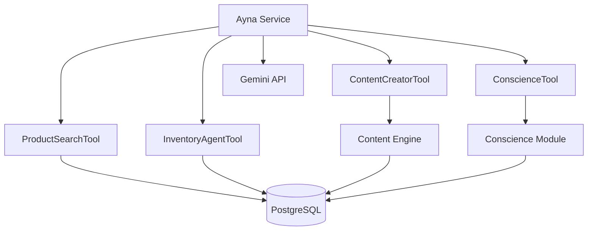

# GENESIS PROTOCOL: MODULE GUIDE (04)
> **Author:** Antigravity / Mirror Core  
> **Last Updated:** 2026-02-09  
> **Status:** STABLE

Bu doküman, PROJECT-AYNA-GENESIS'in özel modüllerini detaylı şekilde açıklar.

---

## 📦 Modül Haritası

```
src/modules/
├── ayna/                    # 🤖 AI Chat Agent
│   ├── index.ts            # Modül tanımı
│   ├── service.ts          # Ana servis (283 satır)
│   ├── models/             # Veritabanı modelleri
│   │   ├── memory.ts       # MemoryTruth, MemoryInsight, MemoryConscience
│   │   └── mission.ts      # Mission
│   ├── tools/              # AI Tool'ları
│   │   ├── product-tool.ts       # Ürün arama
│   │   ├── inventory-tool.ts     # Stok kontrolü
│   │   ├── pool-calculator-tool.ts # Teknik hesaplama
│   │   ├── conscience-tool.ts    # Vicdan filtresi
│   │   └── content-creator-tool.ts # Blog oluşturma
│   └── migrations/         # Veritabanı migration'ları
│
├── content_engine/          # 📝 Blog/CMS Sistemi
│   ├── index.ts
│   ├── service.ts
│   ├── models/
│   │   └── post.ts         # Blog Post modeli
│   └── migrations/
│
├── conscience/              # ⚖️ Vicdan Filtresi
│   ├── index.ts
│   └── service.ts
│
└── manual_payment/          # 💳 Manuel Ödeme (Provider)
    ├── index.ts
    └── service.ts
```

---

## 🤖 AYNA MODULE

### Genel Bakış
Ayna, müşterilere yardımcı olan yapay zeka asistanıdır. Gemini API kullanarak doğal dil işleme yapar ve tool calling ile gerçek zamanlı veri erişimi sağlar.

### Dosya: `src/modules/ayna/service.ts`

```typescript
class AynaService extends MedusaService({
    MemoryTruth,      // Değiştirilemez olay kaydı
    MemoryInsight,    // Kullanıcı bilgisi
    MemoryConscience, // Vicdan kararları
    Mission,          // Görevler
}) {
    async processMessage(message: string, options: any): Promise<{ response: string, debug: any }>
    async recordTruth(actor: string, action: string, data: any): Promise<TruthData>
    async storeInsight(entityId: string, key: string, value: string): Promise<InsightData>
}
```

### Hafıza Modelleri

| Model | Amaç |
|-------|------|
| **MemoryTruth** | Değiştirilemez event logging (actor, action, data) |
| **MemoryInsight** | Kullanıcı öğrenmeleri (entity_id, key, value) |
| **MemoryConscience** | Vicdan kararları ve bütçe uyum logları |
| **Mission** | Görev takibi |

### AI Tool'ları (Detaylı liste için bkz: [06_AYNA_AI_CORE.md](./06_AYNA_AI_CORE.md))

#### 1. ProductSearchTool
```typescript
{
  name: "search_products",
  description: "Ürün veritabanında arama yapar",
  parameters: {
    query: string,  // Arama kelimesi
    limit?: number  // Sonuç limiti (varsayılan: 5)
  }
}
```

#### 2. InventoryAgentTool
```typescript
{
  name: "check_inventory",
  description: "Stok durumunu kontrol eder",
  parameters: {
    productId: string
  }
}
```

#### 3. TechnicalAnalystTool
```typescript
{
  name: "calculatePoolChemicals",
  description: "Havuz kimyasal hesaplaması yapar",
  parameters: {
    volume: number,      // m³
    currentPh?: number,
    targetPh?: number
  }
}
```

#### 4. ConscienceTool
```typescript
{
  name: "conscience_check",
  description: "Bir işlemin etik uygunluğunu değerlendirir",
  parameters: {
    action: string,
    context: object
  }
}
```

#### 5. ContentCreatorTool
```typescript
{
  name: "create_blog_post",
  description: "Blog yazısı oluşturur ve yayınlar",
  parameters: {
    title: string,
    slug: string,
    content: string,
    status?: "draft" | "published"
  }
}
```

#### 6. ProductCreateTool (Sadece Admin Mode)
```typescript
{
  name: "create_product",
  description: "SEO uyumlu yeni bir ürün oluşturur.",
  parameters: {
    title: string,
    handle: string,
    description: string,
    price: number,
    categories: string[],
    sales_channels?: string[]
  }
}
```

#### 7. CategoryTool (Sadece Admin Mode)
```typescript
{
  name: "create_category",
  description: "SEO uyumlu yeni bir kategori oluşturur.",
  parameters: {
    name: string,
    handle: string,
    description: string
  }
}
```

#### 8. InventoryManagerTool (Peak 2.0 - Otonom)
```typescript
{
  name: "manage_inventory",
  description: "Stok/fiyat günceller. Kararı 'Mission' olarak kaydeder.",
  parameters: {
    productId: string,
    action: "update_stock" | "update_price",
    value: number
  }
}
```

#### 9. CampaignTool (Peak 2.0 - Otonom)
```typescript
{
  name: "create_campaign",
  description: "Promosyon planlar. Kararı 'Mission' olarak kaydeder.",
  parameters: {
    campaign_name: string,
    discount_amount: number,
    starts_at?: string,
    ends_at?: string
  }
}
```

### ⚠️ Kritik DML Kuralı
Modüller içindeki modellerde (`models/*.ts`) kesinlikle `model.bigint()` veya `model.double()` kullanılmamalıdır. Bu fonksiyonlar Medusa v2 SDK'sında "not a function" hatasına yol açar. Her zaman **`model.number()`** kullanılmalıdır.

### System Instruction (Prompt)
```
KİMLİK: AYNA (THE MIRROR)
- Ticari dürüstlük ve veriye dayalı analiz uzmanı

KARAR MEKANİZMASI:
1. Dürüstlük Checkpoint: Ürün önermeden önce search_products kullan
2. Stok Kutsallığı: Stokta olmayan ürünü "var" gibi gösterme
3. Segment Duyarlılığı:
   - B2B: Tam adet bilgisi ("15 adet")
   - B2C: Genel durum ("Stokta var")

VİCDAN FİLTRESİ:
Müşterinin parasını ve vaktini koru.
```

---

## 📝 CONTENT ENGINE MODULE

### Genel Bakış
Blog ve CMS yönetimi için kullanılır. AI ile entegre çalışarak otomatik içerik üretimi destekler.

### Dosya: `src/modules/content_engine/models/post.ts`

```typescript
const Post = model.define("post", {
  id: model.id().primaryKey(),
  title: model.text(),
  slug: model.text().unique(),
  content: model.text(),
  image: model.text().nullable(),
  metadata: model.json().nullable(),
  status: model.enum(["draft", "published", "archived"]),
  published_at: model.dateTime().nullable(),
  ai_score: model.number().nullable(),
  
  // SEO Fields
  author: model.text().nullable(),
  excerpt: model.text().nullable(),
  seo_title: model.text().nullable(),
  seo_description: model.text().nullable(),
  view_count: model.number().default(0),
})
```

### API Endpoint'leri
- `GET /admin/posts` - Tüm postları listele
- `GET /admin/posts/:id` - Tek post
- `POST /admin/posts` - Yeni post oluştur
- `PUT /admin/posts/:id` - Güncelle
- `DELETE /admin/posts/:id` - Sil

---

## ⚖️ CONSCIENCE MODULE

### Genel Bakış
AI kararlarının etik değerlendirmesini yapar. Her işlem için "ALLOW" veya "DENY" kararı verir.

### Kullanım
```typescript
const verdict = await conscienceService.evaluate({
  proposed_action: "Stokta olmayan ürün önerisi",
  context: { productId: "prod_xxx", stock: 0 }
})

// Sonuç: { verdict: "DENY", reasoning: "Stokta olmayan ürün önerilemez" }
```

---

## 💳 MANUAL PAYMENT MODULE

### Genel Bakış
Nakit, havale gibi manuel ödeme yöntemlerini destekler.

### Konfigürasyon
`medusa-config.ts` içinde:
```typescript
{
  resolve: "@medusajs/medusa/payment",
  options: {
    providers: [
      {
        resolve: "./src/modules/manual_payment",
        id: "manual",
      }
    ]
  }
}
```

---

## 🔗 Modül Kayıt

Tüm modüller `medusa-config.ts` içinde kayıtlıdır:

```typescript
modules: [
  {
    resolve: "./src/modules/ayna",
    options: { /* ... */ }
  },
  {
    resolve: "./src/modules/content_engine",
  },
  {
    resolve: "./src/modules/conscience",
  },
  // ...
]
```

---

## 🧪 Modül Test Etme

```bash
# Ayna'ya mesaj gönder
curl -X POST http://localhost:9000/store/ayna/chat \
  -H "Content-Type: application/json" \
  -d '{"message": "Havuz için klor lazım"}'

# Blog post oluştur
curl -X POST http://localhost:9000/admin/posts \
  -H "Content-Type: application/json" \
  -d '{"title": "Test", "slug": "test", "content": "<p>İçerik</p>"}'
```

---

## 📊 Modül Bağımlılık Grafiği


